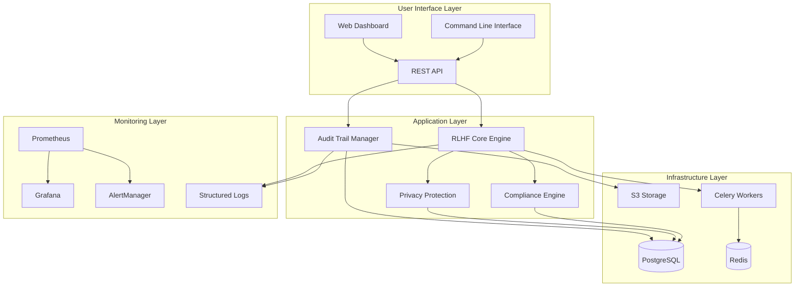
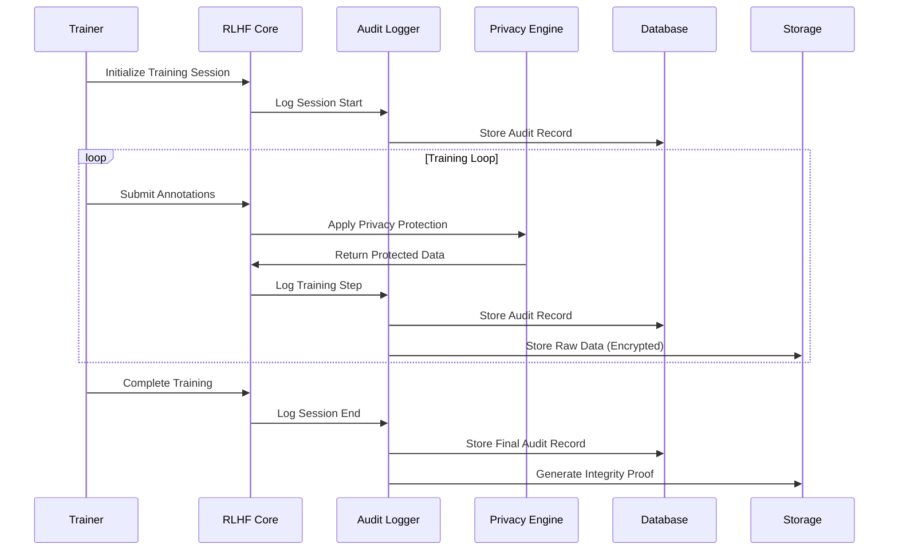
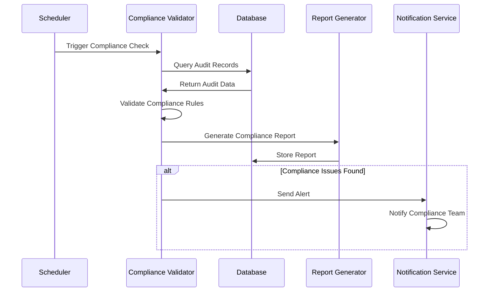
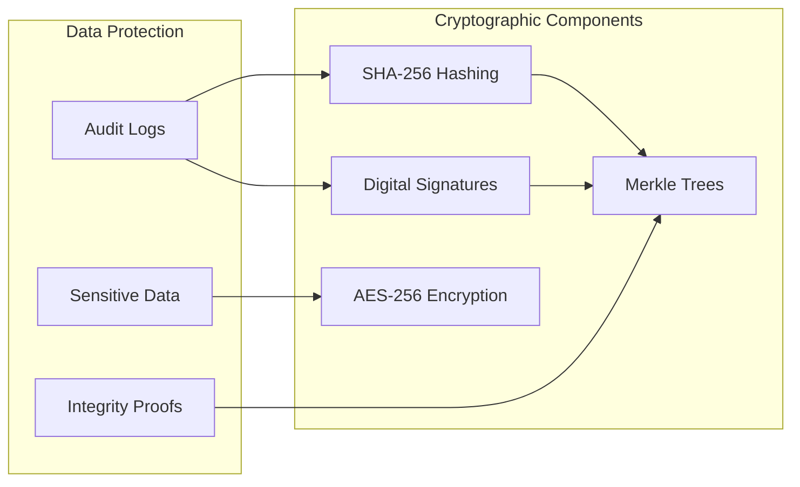
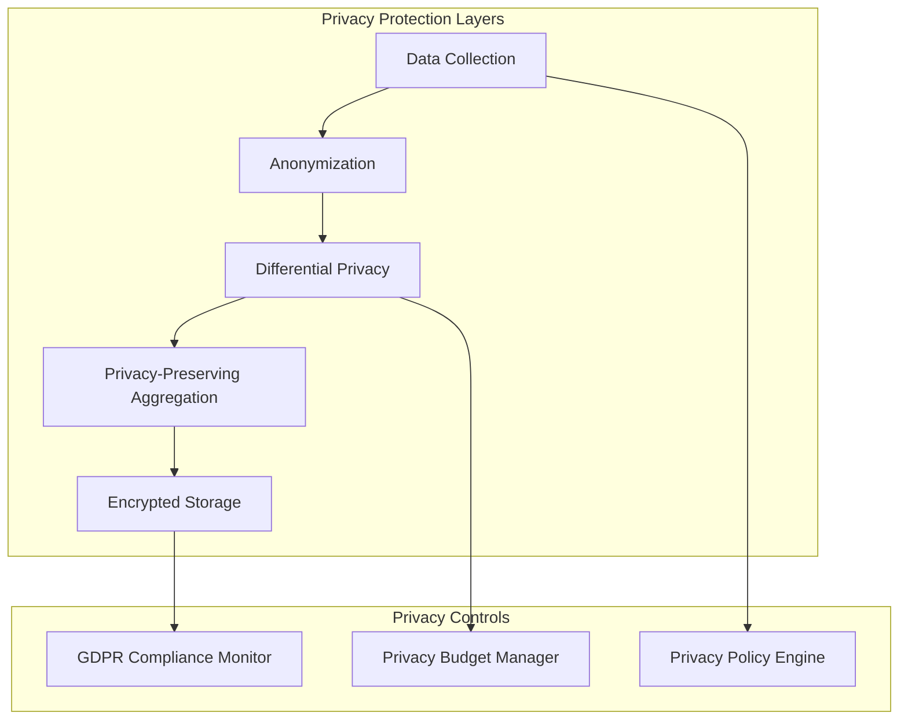
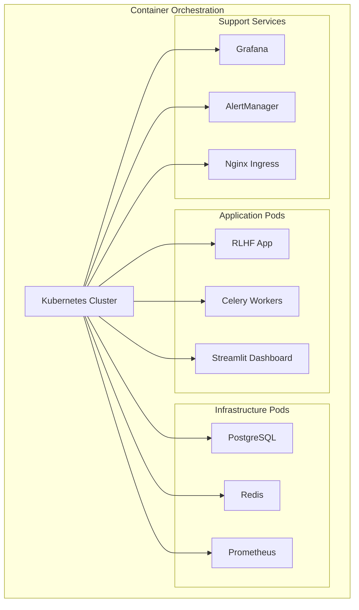
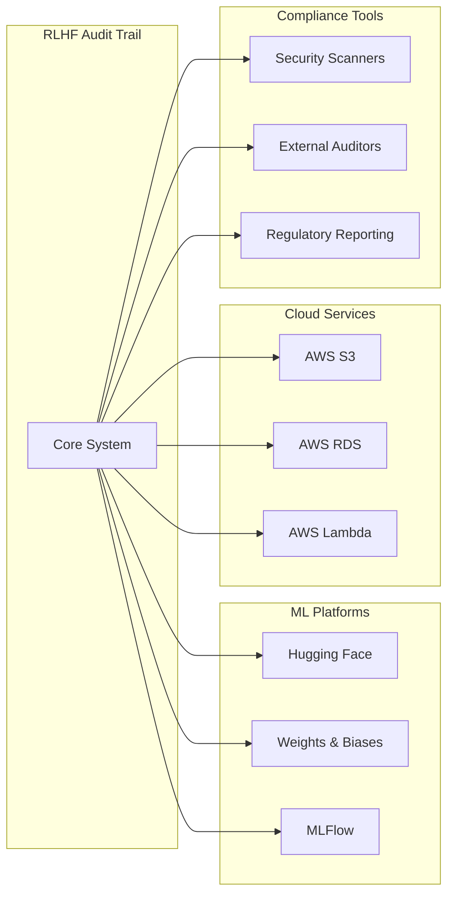

# RLHF Audit Trail - Architecture Documentation

## Overview

The RLHF Audit Trail system provides end-to-end verifiable provenance for Reinforcement Learning from Human Feedback (RLHF) processes, ensuring compliance with the EU AI Act and other regulatory frameworks.

## High-Level Architecture

## Core Components

### 1. RLHF Core Engine (`src/rlhf_audit_trail/core/`)

The central component that orchestrates RLHF training while maintaining comprehensive audit trails.

**Responsibilities:**
- Coordinate RLHF training processes
- Integrate with existing RLHF libraries (TRL, trlx)
- Manage training sessions and checkpoints
- Coordinate with audit and privacy components

**Key Classes:**
- `AuditableRLHF`: Main interface for auditable RLHF training
- `TrainingSession`: Manages individual training sessions
- `ModelCheckpoint`: Handles model versioning and checkpointing

### 2. Audit Trail Manager (`src/rlhf_audit_trail/audit/`)

Provides cryptographically verifiable audit trails for all system operations.

**Responsibilities:**
- Log all RLHF operations immutably
- Generate cryptographic proofs of integrity
- Maintain Merkle tree structures for verification
- Handle audit log storage and retrieval

**Key Classes:**
- `AuditLogger`: Core audit logging functionality
- `MerkleTree`: Cryptographic proof generation
- `IntegrityVerifier`: Audit trail verification

### 3. Privacy Protection (`src/rlhf_audit_trail/privacy/`)

Implements differential privacy and other privacy-preserving techniques.

**Responsibilities:**
- Apply differential privacy to sensitive data
- Manage privacy budgets
- Anonymize annotator information
- Implement privacy-preserving aggregation

**Key Classes:**
- `DifferentialPrivacy`: Core DP implementation
- `PrivacyBudgetManager`: Tracks and manages privacy expenditure
- `DataAnonymizer`: Anonymizes sensitive information

### 4. Compliance Engine (`src/rlhf_audit_trail/compliance/`)

Ensures adherence to regulatory requirements including EU AI Act.

**Responsibilities:**
- Validate compliance with regulatory frameworks
- Generate compliance reports
- Monitor regulatory requirements
- Automated compliance checking

**Key Classes:**
- `ComplianceValidator`: Validates regulatory compliance
- `ReportGenerator`: Creates compliance reports
- `RegulatoryMonitor`: Monitors for regulation changes

## Data Flow Architecture

### Training Data Flow

### Compliance Validation Flow

## Security Architecture

### Defense in Depth

1. **Network Security**
   - TLS encryption for all communications
   - Network segmentation
   - Firewall rules and access controls

2. **Application Security**
   - Input validation and sanitization
   - Authentication and authorization
   - Secure session management
   - CSRF and XSS protection

3. **Data Security**
   - Encryption at rest and in transit
   - Key management and rotation
   - Data anonymization and pseudonymization
   - Secure backup and recovery

4. **Infrastructure Security**
   - Container security scanning
   - Regular security updates
   - Access logging and monitoring
   - Intrusion detection

### Cryptographic Design

## Scalability Architecture

### Horizontal Scaling

The system is designed for horizontal scaling across multiple dimensions:

1. **Application Scaling**
   - Stateless application servers
   - Load balancing across instances
   - Auto-scaling based on metrics

2. **Database Scaling**
   - Read replicas for query distribution
   - Partitioning for large datasets
   - Connection pooling

3. **Storage Scaling**
   - Object storage for audit logs
   - CDN for static assets
   - Tiered storage strategies

4. **Processing Scaling**
   - Distributed task processing with Celery
   - Queue-based async processing
   - Resource-based scaling

### Performance Considerations

- **Caching Strategy**: Multi-layer caching with Redis
- **Database Optimization**: Indexing and query optimization
- **Async Processing**: Non-blocking operations where possible
- **Resource Management**: CPU and memory optimization

## Compliance Architecture

### EU AI Act Compliance

The system implements specific architectural patterns to ensure EU AI Act compliance:

1. **Risk Management System**
   - Continuous risk assessment
   - Risk mitigation tracking
   - Automated risk reporting

2. **Data Governance**
   - Data quality validation
   - Bias detection and mitigation
   - Data lineage tracking

3. **Technical Documentation**
   - Automated documentation generation
   - Version control for documentation
   - Compliance artifact management

4. **Record Keeping**
   - Immutable audit trails
   - Cryptographic integrity verification
   - Long-term data retention

5. **Human Oversight**
   - Human-in-the-loop mechanisms
   - Override capabilities
   - Decision audit trails

### Privacy Architecture

## Deployment Architecture

### Container Architecture

### Environment Architecture

1. **Development Environment**
   - Local Docker Compose setup
   - Hot reloading for development
   - Debug tooling enabled

2. **Staging Environment**
   - Production-like configuration
   - Integration testing
   - Compliance validation

3. **Production Environment**
   - High availability setup
   - Automated backups
   - Monitoring and alerting

## Technology Stack

### Backend Technologies

- **Language**: Python 3.10+
- **Framework**: FastAPI
- **Database**: PostgreSQL 15+
- **Cache**: Redis 7+
- **Task Queue**: Celery
- **ML Libraries**: PyTorch, Transformers, TRL

### Infrastructure Technologies

- **Containerization**: Docker, Docker Compose
- **Orchestration**: Kubernetes
- **Monitoring**: Prometheus, Grafana
- **Logging**: Structured logging with JSON
- **Storage**: AWS S3 (or compatible)

### Security Technologies

- **Encryption**: AES-256, RSA-4096
- **Hashing**: SHA-256, SHA-3
- **TLS**: TLS 1.3
- **Authentication**: JWT tokens
- **Privacy**: Differential Privacy (Opacus)

## Integration Architecture

### External System Integration

### API Architecture

The system exposes multiple API interfaces:

1. **REST API**: Primary interface for web applications
2. **GraphQL API**: Flexible querying for complex data needs
3. **gRPC API**: High-performance interface for service-to-service communication
4. **WebSocket API**: Real-time updates and streaming

## Quality Attributes

### Reliability
- **Availability**: 99.9% uptime target
- **Fault Tolerance**: Graceful degradation
- **Recovery Time**: < 15 minutes for critical failures

### Performance
- **Response Time**: < 200ms for API calls
- **Throughput**: 1000+ concurrent users
- **Scalability**: Horizontal scaling capabilities

### Security
- **Authentication**: Multi-factor authentication
- **Authorization**: Role-based access control
- **Audit**: Complete audit trail for all operations
- **Compliance**: EU AI Act and GDPR compliant

### Maintainability
- **Modularity**: Loosely coupled components
- **Testability**: >90% test coverage
- **Documentation**: Comprehensive API and architecture docs
- **Monitoring**: Real-time system health monitoring

## Future Architecture Evolution

### Planned Enhancements

1. **AI-Powered Compliance**
   - Automated compliance rule interpretation
   - Predictive compliance risk assessment
   - Intelligent report generation

2. **Advanced Privacy Techniques**
   - Federated learning support
   - Homomorphic encryption
   - Secure multi-party computation

3. **Enhanced Scalability**
   - Microservices architecture
   - Event-driven architecture
   - Cloud-native deployment

4. **Extended Integrations**
   - More ML platform integrations
   - Enterprise system connectors
   - Regulatory reporting automation

This architecture provides a solid foundation for building a compliant, scalable, and maintainable RLHF audit trail system while ensuring regulatory compliance and operational excellence.