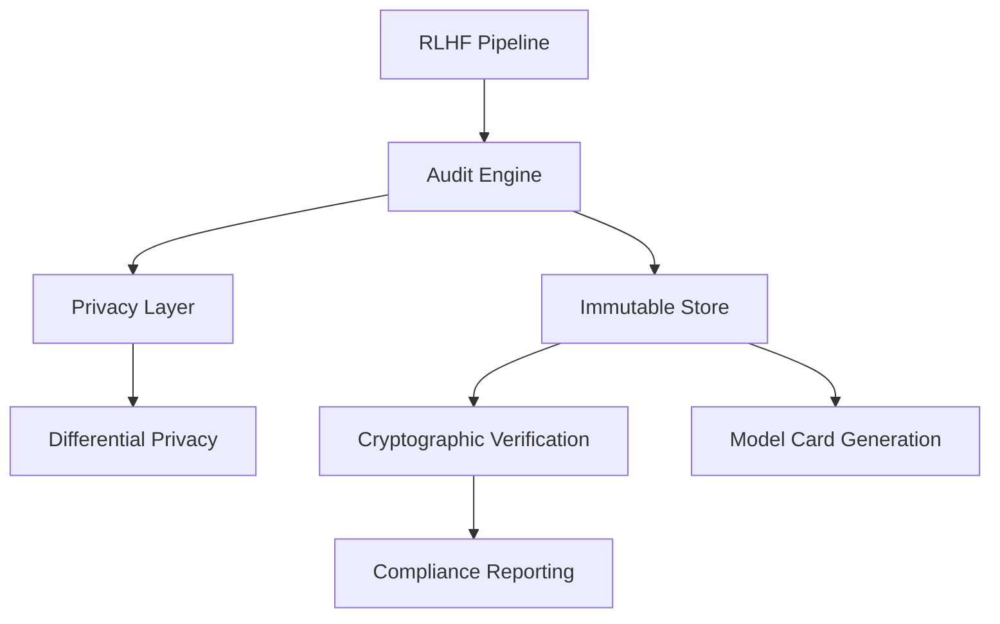

# RLHF Audit Trail Documentation

Welcome to the comprehensive documentation for the RLHF Audit Trail project - your complete solution for verifiable provenance in Reinforcement Learning from Human Feedback with EU AI Act compliance.

## Quick Navigation

### Getting Started
- [Installation Guide](installation.md)
- [Quick Start Tutorial](quickstart.md)
- [Configuration Guide](configuration.md)

### Core Features
- [Audit Trail System](features/audit-trail.md)
- [Privacy Protection](features/privacy.md)
- [Compliance Framework](features/compliance.md)
- [Model Card Generation](features/model-cards.md)

### API Reference
- [Core API](api/core.md)
- [Configuration](api/config.md)
- [Privacy Module](api/privacy.md)
- [Storage Backends](api/storage.md)

### Compliance
- [EU AI Act Compliance](compliance/eu-ai-act.md)
- [NIST Framework Alignment](compliance/nist.md)
- [Privacy Analysis](compliance/privacy-analysis.md)
- [Audit Best Practices](compliance/best-practices.md)

### Development & Operations
- [Contributing Guidelines](../CONTRIBUTING.md)
- [Security Policy](../SECURITY.md)
- [Architecture Overview](ARCHITECTURE.md)
- [Testing Guide](../tests/docs/testing_guide.md)
- [**SDLC Implementation Guide**](SDLC_IMPLEMENTATION_GUIDE.md) ⭐
- [**SDLC Checkpoint Strategy**](SDLC_CHECKPOINT_STRATEGY.md) 🚀
- [Development Environment](DEVELOPMENT.md)
- [Deployment Guide](deployment/)
- [Monitoring & Observability](../monitoring/docs/)

## Project Overview

The RLHF Audit Trail provides end-to-end tracking and verification for RLHF pipelines, ensuring transparency and compliance with emerging AI regulations.

### Key Features

- **Complete RLHF Tracking**: Every annotation, reward signal, and policy update
- **Cryptographic Provenance**: Immutable audit logs with Merkle tree verification
- **Privacy-Preserving**: Integrated differential privacy for annotator protection
- **Regulatory Compliant**: Meets EU AI Act & NIST transparency requirements
- **Model Card Generation**: Auto-generates comprehensive, auditable documentation
- **Real-time Monitoring**: Live dashboards for RLHF progress and anomaly detection

### Architecture

## Support

- **GitHub Issues**: [Bug reports and feature requests](https://github.com/terragonlabs/rlhf-audit-trail/issues)
- **Discussions**: [Community discussions](https://github.com/terragonlabs/rlhf-audit-trail/discussions)
- **Email**: compliance@terragonlabs.com

## License

This project is licensed under the MIT License - see the [LICENSE](../LICENSE) file for details.
