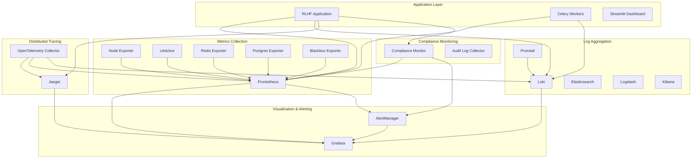

# RLHF Audit Trail - Observability Guide

## Overview

This guide covers the comprehensive observability stack for the RLHF Audit Trail system, including monitoring, logging, tracing, and alerting with a focus on compliance and privacy requirements.

## Architecture

### Observability Stack Components



## Quick Start

### Development Environment

Start the complete observability stack for development:

```bash
# Start base services
docker-compose -f docker-compose.dev.yml up -d

# Start extended monitoring stack
docker-compose -f monitoring/docker-compose.monitoring.yml up -d

# Access dashboards
open http://localhost:3000    # Grafana
open http://localhost:9090    # Prometheus
open http://localhost:16686   # Jaeger
open http://localhost:3100    # Loki
```

### Production Environment

```bash
# Start production stack with monitoring
docker-compose -f docker-compose.yml -f monitoring/docker-compose.monitoring.yml up -d

# Enable ELK stack (optional)
docker-compose -f docker-compose.yml -f monitoring/docker-compose.monitoring.yml --profile elk up -d
```

## Components Deep Dive

### Metrics Collection

#### Prometheus Configuration

**Key Features:**
- 15-second scrape intervals for real-time monitoring
- Compliance-specific metric collection
- Privacy budget tracking
- Audit trail integrity monitoring
- 30-day retention with compression

**Important Metrics:**
```promql
# RLHF-specific metrics
rlhf_training_loss
rlhf_annotation_count
rlhf_model_checkpoints_total
rlhf_privacy_budget_used
rlhf_compliance_score

# System metrics
system_cpu_usage
system_memory_usage
container_memory_usage
database_connections
redis_memory_usage
```

#### Custom Exporters

**Node Exporter:**
- System-level metrics (CPU, memory, disk, network)
- Host-level monitoring
- Hardware health metrics

**cAdvisor:**
- Container resource usage
- Container performance metrics
- Docker daemon metrics

**Application Metrics:**
- Custom business metrics
- Compliance validation metrics
- Privacy budget tracking
- Training progress metrics

### Log Aggregation

#### Loki Configuration

**Compliance Features:**
- 7-year log retention (EU AI Act requirement)
- Structured log ingestion
- Privacy-aware log filtering
- Compliance labeling

**Log Categories:**
```bash
# Application logs
{service="rlhf-audit-trail", level="info"}

# Audit logs (compliance-critical)
{log_category="audit", compliance_required="true"}

# Privacy logs
{log_category="privacy", gdpr_relevant="true"}

# Performance logs
{log_category="performance", monitoring_enabled="true"}

# System logs
{log_category="system"}
```

#### Promtail Configuration

**Privacy Protection:**
- Automatic PII redaction
- Sensitive data filtering
- Anonymization of identifiers
- GDPR-compliant log processing

**Log Parsing Pipeline:**
1. JSON log parsing
2. Timestamp extraction
3. Label assignment
4. Privacy filtering
5. Compliance labeling

### Distributed Tracing

#### Jaeger Tracing

**Compliance Tracing:**
- Full request tracing through RLHF pipeline
- Privacy operation tracking
- Audit event correlation
- Cross-service dependency mapping

**Key Trace Operations:**
- Training session lifecycle
- Annotation processing
- Model checkpoint creation
- Compliance validation
- Privacy budget allocation

#### OpenTelemetry Collector

**Features:**
- Multi-format trace ingestion (OTLP, Jaeger, Zipkin)
- Trace sampling and filtering
- Privacy-aware attribute filtering
- Resource attribution
- Batch processing for performance

### Compliance Monitoring

#### Custom Compliance Monitor

**Automated Checks:**
- EU AI Act requirement validation
- GDPR compliance verification
- Data retention policy enforcement
- Privacy budget monitoring
- Audit trail integrity verification

**Alert Conditions:**
- Compliance score below threshold
- Privacy budget exceeded
- Audit trail gaps detected
- Retention policy violations
- Missing compliance documentation

### Alerting

#### AlertManager Configuration

**Alert Categories:**

**Critical Alerts:**
- Application down
- Database connection failures
- Privacy budget exhausted
- Compliance violations
- Audit trail corruption

**Warning Alerts:**
- High resource usage
- Slow response times
- Privacy budget approaching limit
- Missing compliance checks
- Log ingestion delays

**Example Alert Rules:**

```yaml
# High privacy budget usage
- alert: PrivacyBudgetHigh
  expr: rlhf_privacy_budget_used > 0.8
  for: 5m
  labels:
    severity: warning
    component: privacy
  annotations:
    summary: "Privacy budget usage is high"
    description: "Privacy budget usage is {{ $value }}%, approaching the limit"

# Compliance score low
- alert: ComplianceScoreLow
  expr: rlhf_compliance_score < 0.9
  for: 2m
  labels:
    severity: critical
    component: compliance
  annotations:
    summary: "Compliance score below threshold"
    description: "Compliance score is {{ $value }}, below required 0.9 threshold"

# Audit trail integrity failure
- alert: AuditTrailIntegrityFailure
  expr: rlhf_audit_integrity_check == 0
  for: 1m
  labels:
    severity: critical
    component: audit
  annotations:
    summary: "Audit trail integrity check failed"
    description: "Audit trail integrity verification has failed"
```

## Dashboards

### Grafana Dashboards

#### 1. RLHF Overview Dashboard

**Panels:**
- Training progress and loss curves
- Annotation throughput
- Model checkpoint status
- Resource utilization
- Error rates and latencies

#### 2. Compliance Dashboard

**Panels:**
- Compliance score trending
- Regulatory requirement status
- Audit event timeline
- Data retention compliance
- Privacy impact assessments

#### 3. Privacy Dashboard

**Panels:**
- Privacy budget utilization
- Differential privacy parameters
- Anonymization metrics
- Data minimization tracking
- GDPR compliance indicators

#### 4. Performance Dashboard

**Panels:**
- Response time percentiles
- Throughput metrics
- Resource consumption
- Error rate analysis
- SLA adherence

#### 5. Infrastructure Dashboard

**Panels:**
- System resource usage
- Container metrics
- Database performance
- Cache hit rates
- Network utilization

### Custom Metrics

#### Application Metrics

```python
# Example custom metrics in application
from prometheus_client import Counter, Histogram, Gauge

# Training metrics
training_loss = Gauge('rlhf_training_loss', 'Current training loss')
annotations_processed = Counter('rlhf_annotations_total', 'Total annotations processed')
model_checkpoints = Counter('rlhf_checkpoints_total', 'Total model checkpoints created')

# Compliance metrics
compliance_score = Gauge('rlhf_compliance_score', 'Current compliance score')
audit_events = Counter('rlhf_audit_events_total', 'Total audit events', ['event_type'])

# Privacy metrics
privacy_budget_used = Gauge('rlhf_privacy_budget_used', 'Privacy budget utilization')
dp_epsilon_spent = Counter('rlhf_dp_epsilon_total', 'Total differential privacy epsilon spent')

# Performance metrics
request_duration = Histogram('rlhf_request_duration_seconds', 'Request duration')
active_sessions = Gauge('rlhf_active_sessions', 'Number of active training sessions')
```

## Log Analysis

### Common Log Queries

#### Loki Queries

```logql
# Application errors in last hour
{service="rlhf-audit-trail", level="error"} |= "error" | json | line_format "{{.timestamp}} - {{.message}}"

# Compliance events
{log_category="audit", compliance_required="true"} | json | line_format "{{.event_type}}: {{.action}} - {{.result}}"

# Privacy budget usage
{log_category="privacy"} | json | epsilon_used > 0.5

# High response times
{log_category="performance"} | json | response_time > 1000

# Failed compliance checks
{compliance_check!=""} | json | result="failed"
```

#### Elasticsearch Queries (if using ELK stack)

```json
{
  "query": {
    "bool": {
      "must": [
        {"term": {"service": "rlhf-audit-trail"}},
        {"term": {"compliance_required": true}},
        {"range": {"timestamp": {"gte": "now-1h"}}}
      ]
    }
  },
  "sort": [{"timestamp": {"order": "desc"}}]
}
```

### Log Retention and Compliance

#### Retention Policies

**Audit Logs:** 7 years (EU AI Act requirement)
**Application Logs:** 90 days
**Performance Logs:** 30 days
**System Logs:** 30 days
**Debug Logs:** 7 days

#### Compliance Features

- **Tamper-evident logging:** Cryptographic signatures
- **Access auditing:** Log access tracking
- **Data classification:** Automatic log categorization
- **Privacy protection:** PII redaction and anonymization
- **Retention enforcement:** Automatic purging after retention period

## Tracing and APM

### Distributed Tracing Setup

#### Application Instrumentation

```python
# OpenTelemetry instrumentation example
from opentelemetry import trace
from opentelemetry.exporter.jaeger.thrift import JaegerExporter
from opentelemetry.sdk.trace import TracerProvider
from opentelemetry.sdk.trace.export import BatchSpanProcessor

# Configure tracing
trace.set_tracer_provider(TracerProvider())
tracer = trace.get_tracer(__name__)

jaeger_exporter = JaegerExporter(
    agent_host_name="jaeger",
    agent_port=6831,
)

span_processor = BatchSpanProcessor(jaeger_exporter)
trace.get_tracer_provider().add_span_processor(span_processor)

# Trace RLHF operations
@tracer.start_as_current_span("rlhf_training_step")
def training_step(data):
    with tracer.start_as_current_span("process_annotations") as span:
        span.set_attribute("annotation_count", len(data.annotations))
        span.set_attribute("privacy_budget_used", data.privacy_budget)
        # Processing logic
```

#### Key Traces

- **Training Pipeline:** End-to-end training workflow
- **Compliance Validation:** Regulatory check processes
- **Privacy Operations:** DP noise application, anonymization
- **Audit Logging:** Event recording and verification
- **API Requests:** User interaction tracing

### Performance Monitoring

#### SLI/SLO Definition

**Service Level Indicators (SLIs):**
- API response time: 95th percentile < 500ms
- Training throughput: > 100 annotations/minute
- System availability: > 99.9%
- Compliance score: > 0.95
- Privacy budget efficiency: < 80% utilization

**Service Level Objectives (SLOs):**
- 99.9% availability over 30-day period
- 95% of API requests under 500ms
- Zero compliance violations
- 100% audit trail integrity
- 99% privacy requirement adherence

## Troubleshooting

### Common Issues

#### High Memory Usage

```bash
# Check container memory usage
docker stats

# Query memory metrics
curl http://localhost:9090/api/v1/query?query=container_memory_usage_bytes

# Grafana dashboard: Infrastructure -> Memory Usage
```

#### Missing Metrics

```bash
# Check Prometheus targets
curl http://localhost:9090/api/v1/targets

# Verify service discovery
docker logs rlhf-prometheus

# Check network connectivity
docker exec rlhf-prometheus wget -qO- http://app:8000/metrics
```

#### Log Ingestion Issues

```bash
# Check Promtail status
docker logs rlhf-promtail

# Verify Loki connectivity
curl http://localhost:3100/ready

# Check log file permissions
docker exec rlhf-promtail ls -la /var/log/
```

#### Tracing Problems

```bash
# Check Jaeger collector
curl http://localhost:14268/api/traces

# Verify OpenTelemetry collector
curl http://localhost:13133

# Check trace sampling rates
docker logs rlhf-otel-collector
```

### Performance Optimization

#### Resource Allocation

```yaml
# Docker Compose resource limits
services:
  prometheus:
    deploy:
      resources:
        limits:
          memory: 2G
          cpus: '1.0'
        reservations:
          memory: 1G
          cpus: '0.5'
```

#### Metric Optimization

- **Reduce cardinality:** Limit label combinations
- **Optimize scrape intervals:** Balance frequency vs. resource usage
- **Use recording rules:** Pre-compute expensive queries
- **Implement metric retention:** Different retention for different metric types

## Security

### Access Control

#### Grafana Security

```bash
# Default admin credentials (change immediately)
Username: admin
Password: admin

# Create read-only users for compliance team
# Enable LDAP/OAuth integration for enterprise use
```

#### Prometheus Security

- **Network isolation:** Internal network only
- **Authentication:** Basic auth or OAuth proxy
- **TLS encryption:** Enable for production
- **Query restrictions:** Limit query complexity

### Data Privacy

#### Log Privacy

- **PII redaction:** Automatic sensitive data removal
- **Access logging:** Track who accesses what logs
- **Anonymization:** Hash or remove identifiers
- **Encryption:** Encrypt logs at rest and in transit

#### Metric Privacy

- **Aggregation:** Use summary statistics instead of raw values
- **Sampling:** Reduce data granularity
- **Access control:** Role-based metric access
- **Retention limits:** Shorter retention for sensitive metrics

## Best Practices

### Monitoring Best Practices

1. **Define clear SLIs/SLOs:** Measure what matters for compliance
2. **Implement progressive alerting:** Warning -> Critical -> Emergency
3. **Use meaningful labels:** Enable efficient querying and filtering
4. **Monitor the monitoring stack:** Meta-monitoring for reliability
5. **Regular testing:** Verify alerts and dashboards regularly

### Compliance Best Practices

1. **Automated compliance checks:** Continuous validation
2. **Immutable audit logs:** Tamper-evident logging
3. **Regular compliance reports:** Automated report generation
4. **Access documentation:** Clear audit trail access procedures
5. **Retention enforcement:** Automated policy compliance

### Performance Best Practices

1. **Optimize query performance:** Use efficient PromQL queries
2. **Implement caching:** Reduce redundant data processing
3. **Monitor resource usage:** Prevent monitoring overhead
4. **Use appropriate retention:** Balance storage vs. compliance needs
5. **Regular maintenance:** Clean up unused metrics and logs

## Integration

### CI/CD Integration

```yaml
# GitHub Actions example
- name: Check monitoring health
  run: |
    curl -f http://localhost:9090/-/healthy
    curl -f http://localhost:3100/ready
    curl -f http://localhost:16686/api/services
```

### External Tools

#### SIEM Integration

- **Splunk:** Forward logs via HTTP Event Collector
- **ELK Stack:** Native Elasticsearch integration
- **QRadar:** Syslog forwarding
- **Azure Sentinel:** Azure Monitor integration

#### Compliance Tools

- **GRC platforms:** API integration for compliance reporting
- **Audit tools:** Log export for audit evidence
- **Risk management:** Metric integration for risk scoring

## Support

### Getting Help

1. **Check dashboards:** Review Grafana dashboards for obvious issues
2. **Query logs:** Use Loki/Elasticsearch for detailed investigation  
3. **Review traces:** Analyze Jaeger traces for request flow issues
4. **Check alerts:** Review AlertManager for active alerts
5. **Consult documentation:** Reference this guide and component docs

### Escalation Procedures

1. **Level 1:** Check dashboards and basic troubleshooting
2. **Level 2:** Deep log analysis and metric investigation
3. **Level 3:** Trace analysis and system debugging
4. **Level 4:** Compliance team involvement for regulatory issues

For detailed component-specific documentation, refer to:
- [Prometheus Documentation](https://prometheus.io/docs/)
- [Grafana Documentation](https://grafana.com/docs/)
- [Loki Documentation](https://grafana.com/docs/loki/)
- [Jaeger Documentation](https://www.jaegertracing.io/docs/)
- [OpenTelemetry Documentation](https://opentelemetry.io/docs/)